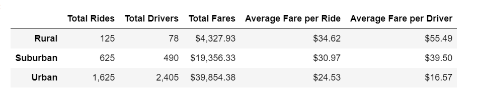

# **PyBer_Analysis**
Analysis for PyBer company
## Overview of Project
The project was to performace an exploratory analysis on data in various csv files and create visualizations to tell the story behind the data. In the challenge file, we created a summary DataFrame of the ride-sharing data by city type. A multiple-line graph in the file shows the total weekly fares for each city type.
## Results

**Total Rides**: The highest number of total rides happens in urbna areas. Suburban area has the second highest of total rides number, but it is less than half of urban total rides. Rural areas only have over a hundred total rides numbers.
 **Total Drivers**: The number of total drivers in urban, suburban and rural areas seem proportionate to the total rides. As a result, urban has the highest number of drivers which is over 2,000, suburban has the second highest number of total drivers, and rural areas has the least number of drivers.
 **Total Fares**: Urban areas generate almost $40,000 amount of fares. Suburban areas generate almost $20,000 amount of fares that is aprroximately half of urban total fares. Rural areas generate over $4,000 amount of total fares that is a little over 1/10 of the amount of urban total fares.
 **Average Fare per Ride and Driver**: The order of average fare per ride and per driver is reversed. Rural areas has the highest average fare per ride and driver, second are the suburban areas and the last are the urban areas. 
 **Total Fare by City Type**: In conclusion, although urban areas has the least average fare per ride and driver, it still generates the highest total fares among these three city types, followed by suburban and rural areas. The main reason is because of the unbeatable number of total rides in urban areas.
## Summary/Recommendations
1. Urban areas are more compact compared to suburban and rural areas. This caused it to have the least average fare per ride and driver. On the other hand, rural reas are wild and less convenient, as a result road distance for each ride is further.
2. Public transit in urban areas is on higher demand because of cost of time and money. It is very difficult to park in urban areas, and the parking fares sometimes are more expensive than round-trip taxi fares. As a result, the number of total rides in urban areas is way higher than it in suburban and rural areas.
3. Lifestyles in urban, suburban and rural areas are significantly different. In urban areas, everything is fast. People need to get to work on time, to pickup their children at schools on time, to get to meetings and conferences on time...As a result, in urban areas, people would be willing to spend money to save some time in a lot of circumstances.
